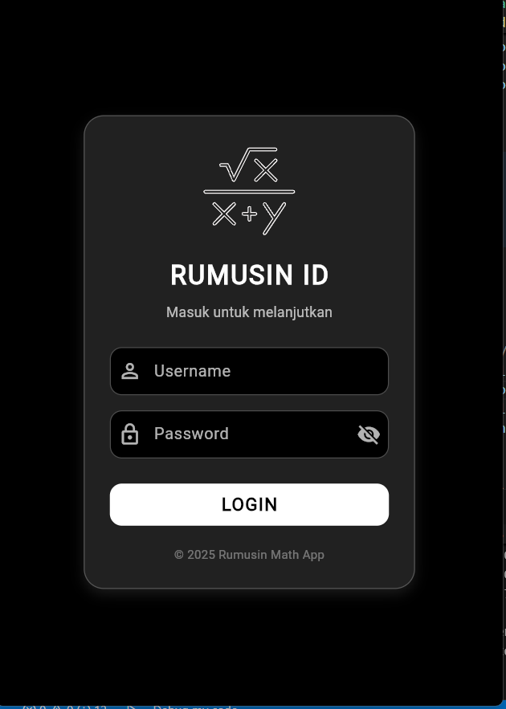
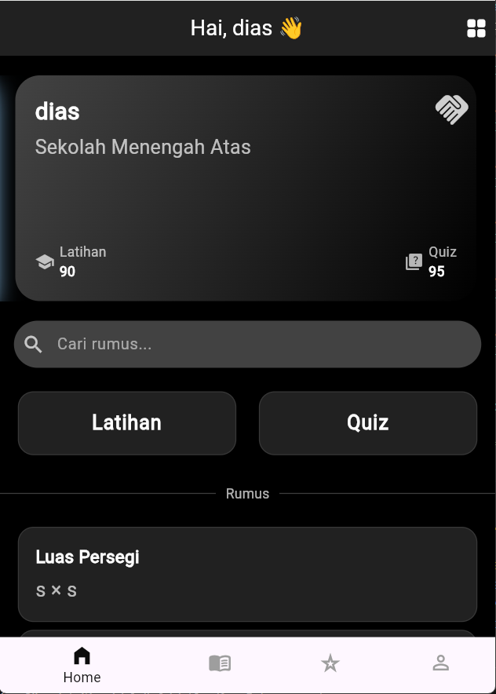
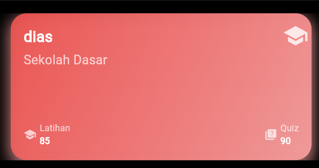
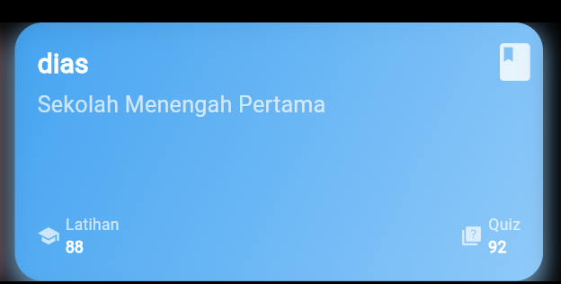
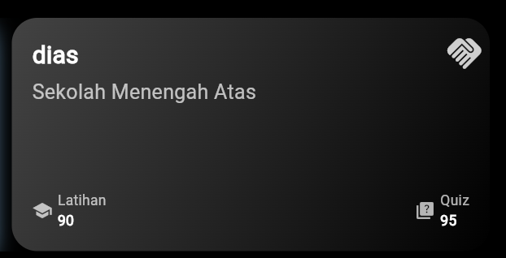

# 📘 rumusin.id — Aplikasi Pembelajaran Matematika (Flutter)

**rumusin.id** adalah aplikasi edukasi berbasis *Flutter* yang dirancang untuk membantu siswa belajar matematika dengan mudah.  
Aplikasi ini menyediakan fitur rumus, latihan soal, quiz, dan progress belajar dengan tampilan modern dan interaktif.

---
## 😎 Dibuat oleh
  **● Dias Andhika Irawan (232101204)**
---
## 🚀 Fitur Utama

### 📚 **Rumus Matematika**
- Menampilkan berbagai rumus dasar matematika.
- Tersedia dalam tampilan *list* dan *grid*.
- Setiap rumus ditampilkan di dalam kartu (RumusCard).

### 📝 **Latihan Soal**
- Berisi soal latihan per materi.
- Nilai tersimpan dan ditampilkan pada kartu.

### ❓ **Quiz**
- Quiz cepat untuk menguji pemahaman.
- Skor tersimpan dan ditampilkan pada dashboard.

### 🎓 **Education Card**
- Menampilkan data belajar: nama, level, nilai latihan, dan nilai quiz.
- Memiliki desain kartu dengan *gradient background* yang menarik.
- Setiap jenjang Pendidikan berbeda beda desain kartunya

### 🎨 **UI Modern & Responsive**
- Menggunakan `Stack`, `Container`, dan efek visual seperti *shadow* dan *gradient*.
- Mendukung toggling **List View ↔ Grid View**.

---

## 🛠️ Teknologi yang Digunakan
- **Flutter**
- **Dart**
- State management bawaan (`setState`)
- Custom Widgets:
  - `RumusCard`
  - `LatihanQuisCard`
  - `EducationCard`
---
## 🔗 Link G-Drive Laporan dan Hasil Running APK
https://drive.google.com/drive/folders/1faw6mwScrPvZaLpedWgTkWRIPCtG_gRl?usp=drive_link

---

# 📸 Screenshot Aplikasi
---

## 🟦 1. Splash Screen  

---

## 🟩 2. Halaman Login  

---

## 🟨 3. Halaman Home (Default)  

---

## 🟧 4. Jenis-Jenis Kartu berdasarkan jenjang Pendidikan  
- card Sekolah dasar

- card Sekolah Menengah Pertama

- card Sekolah Menengah Atas

---

## 🟪 5. Home Mode List  
> Tampilan kartu disusun secara vertikal.

---

## 🟥 6. Home Mode Grid  
> Tampilan kartu disusun 2 kolom (grid view).

---
